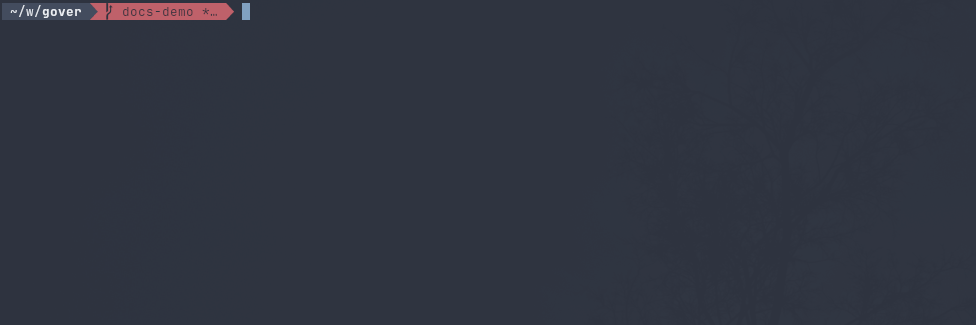

# Gover
**_Gover_** is a command line tool designed to help you manage commit messages, repository tags, and versions with ease.

Versioning commands:


Preconfigured commit message prompt:


## Configuration
See gover.yml file:
```yaml
templates:
  # define commit message template
  commit: |
    {{.Type}}({{.Scope}}): {{.Message}}
    {{if (ne .Description "") }}
    {{.Description}}
    {{end}}
    {{- if (ne .Task "") }}
    Closes #{{.Task}}
    {{- end}}
  changelog: |
    {{- if .Type.feat -}}
    # 🚀 Features:
      {{- range $commit := .Type.feat}}
        - {{$commit.Scope}} - {{$commit.Message}}
      {{- end}}
    {{ end }}
    {{- if .Type.fix -}}
    # 🔧 Fixes:
      {{- range $commit := .Type.fix}}
        - {{$commit.Scope}} - {{$commit.Message}}
      {{- end}}
    {{ end }}
    {{- if .Type.docs -}}
    # 📄 Documentation:
      {{- range $commit := .Type.docs}}
        - {{$commit.Scope}} - {{$commit.Message}}
      {{- end -}}
    {{- end -}}
args: # template arguments
  - name: Type # specification for .Type template field
    required: true # fail on missing argument
    options: # display prompt with selection
      - value: feat! # option to select
        version: major # impact on versioning
        description: "backward incompatible changes"
      - value: feat
        version: minor
        description: "backward compatible features"
      - value: fix
        version: patch
        description: "application fixes"
      - value: perf
        version: patch
        description: "performance improvements"
      - value: refactor
        version: patch
        description: "code or architecture refactor"
      - value: test
        version: patch
        description: "application automatic tests"
      - value: style
        version: patch
        description: "content look and formatting"
      - value: build
        version: patch
        description: "application build process"
      - value: docs # do not affect versioning
        description: "code documentation"
      - value: ci
        description: "continuous integration tooling"
  - name: Scope # specification for .Scope template field - simple text input
    required: true
  - name: Message
    required: true
  - name: Description
  - name: Task
```
## Usage
Print latest known tag:
```
$ gover latest . # prints latest tag
  v1.2.3
```
Print next tag based on commits since latest known tag:
```
$ gover next .   # prints next tag
  v1.3.0
```
Verify commit messages since latest known tag:
```
$ gover tag .             # creates new tag
$ gover --pre=build tag . # creates new pre-release tag
```
Run commit message prompt from configuration file to create new commit message. See /hooks for example of the hook that passes created with prompt message into default commit text editor to submit:
```
$ gover commit .
	Use the arrow keys to navigate: ↓ ↑ → ←
	? Type:
	  ✔ feat! (backward incompatible changes)
	    feat (backward compatible features)
	    fix (application fixes)
	    perf (performance improvements)
	↓   refactor (code or architecture refactor)
```
For more information, see help:
```
$ gover help

```
